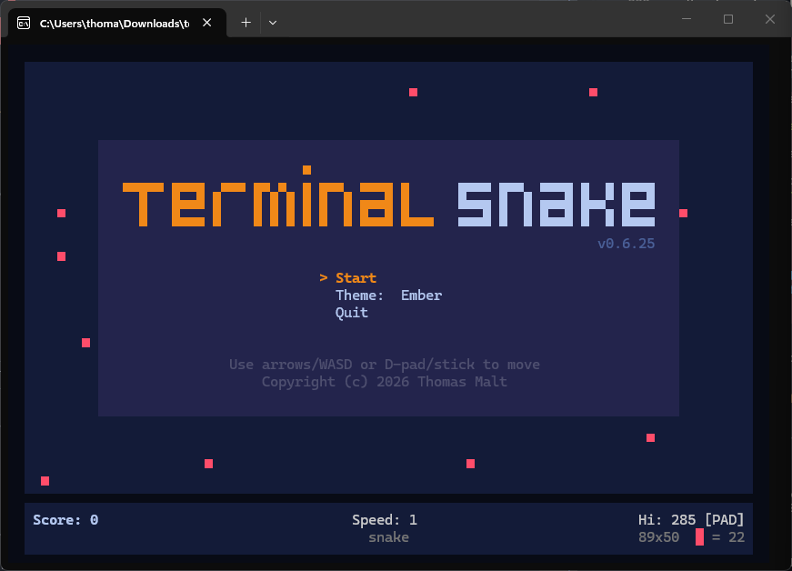

# Terminal Snake

This is a retro terminal-based Snake game written in Rust, with a modern terminal first
interface. 

As someone who enjoy doing work in the terminal I wanted to create a "making time pass while compiling -> waiting for the AI-model to finish thinking" snake game with a modern TUI feel.



## Requirements

- A terminal emulator with 256-color or truecolor support.
- A font that renders Unicode block elements correctly (e.g. any Nerd Font,
  or any modern monospace font — no special glyphs beyond `▀`, `▄`, `█`).

## Install

### Homebrew (macOS/Linux)

```bash
brew install tfmalt/tap/terminal-snake
# or:
# brew tap tfmalt/tap
# brew install terminal-snake
```

### Prebuilt binaries (Linux/macOS/Windows)

Download the archive for your platform from GitHub Releases:

- https://github.com/tfmalt/terminal-snake/releases

Then extract and run `terminal-snake` (or `terminal-snake.exe` on Windows).
Each release includes `SHA256SUMS` for integrity verification.

### Rust/Cargo (build from source)

```bash
cargo install --git https://github.com/tfmalt/terminal-snake terminal-snake
```

## Building

```bash
cargo build --release
```

The binary is placed at `target/release/terminal-snake`.

### Windows support

- Native Windows is supported on `x86_64-pc-windows-msvc` in **PowerShell + Windows Terminal**.
- Recommended fonts: **Cascadia Mono** or **Cascadia Code** for reliable `▀`, `▄`, `█` rendering.
- Persistence path on Windows uses `LOCALAPPDATA`:
  `%LOCALAPPDATA%\terminal-snake\scores.json`.
- If your terminal/font renders block glyphs poorly, use `--ascii-glyphs` or set
  `TERMINAL_SNAKE_GLYPHS=ascii`.
- Known limitation: ASCII fallback keeps gameplay functional but loses the
  half-block visual fidelity (coarser cell rendering).

## Running

If installed via package:

```bash
terminal-snake
```

If you've downloaded the source:

```bash
cargo run --release
# or after building:
./target/release/terminal-snake
```

CLI options:

```
Options:
      --speed <SPEED>    Starting speed level [default: 1]
      --width <WIDTH>    Grid width in logical cells (defaults to terminal width)
      --height <HEIGHT>  Grid height in logical cells (defaults to terminal height)
      --no-controller    Disable controller input even when available
      --debug            Show diagnostic debug line at the bottom of the screen
      --ascii-glyphs     Use an ASCII-safe glyph palette for poor font environments
  -h, --help             Print help
```

## Features

- **Half-block rendering** — every game cell is two Unicode half-block
  characters composited together, giving a smooth, colorful appearance without
  color-emoji dependency.
- **Game controller support** — D-pad and analog stick via `gilrs` (disabled
  automatically on WSL).
- **12 built-in themes** — Ayu, Catppuccin, Ember, Everforest, Gruvbox,
  Matrix, Nord, One Dark, OpenCode, System, tm, and Tokyo Night. 
- **User themes** — drop JSON files into
  `~/.config/terminal-snake/themes/` (or `$XDG_CONFIG_HOME/terminal-snake/themes/`)
  to add or override themes at runtime.
- **In-game theme picker** — browse themes from the start menu or pause menu;
  selection is saved and restored between runs.
- **Terminal resize handling** — the game grid resizes live as the terminal
  window changes size. Resize the terminal mid game and continue playing.


## Controls

| Action          | Keyboard                        | Controller         |
|-----------------|---------------------------------|--------------------|
| Move            | Arrow keys or W A S D           | D-pad / left stick |
| Pause / resume  | P or Esc                        | Start              |
| Confirm / select| Enter or Space                  | A                  |
| Quit            | Q or Ctrl-C                     | —                  |
| Cycle theme     | T (during gameplay)             | —                  |

In menus, `Up`/`Down` navigate items and `Enter`/`Space`/`→` confirms.
Press `Esc`/`←`/`Enter` to close the inline theme picker.

## Themes

Built-in themes are embedded at compile time from `assets/themes/*.json`.
User themes are loaded from:

```
~/.config/terminal-snake/themes/*.json          # Linux / WSL / macOS
$XDG_CONFIG_HOME/terminal-snake/themes/*.json   # if XDG_CONFIG_HOME is set
```

User themes overlay built-in ones — a file with the same base name overrides
the built-in theme of that name.

A theme JSON file looks like:

```json
{
  "name": "My Theme",
  "snake_head": "#e06c75",
  "snake_body": "#98c379",
  "snake_tail": "#61afef",
  "food": "#e5c07b",
  "terminal_bg": "reset",
  "field_bg": "#282c34",
  "ui_bg": "#21252b",
  "ui_text": "#abb2bf",
  "ui_accent": "#e06c75",
  "ui_muted": "#5c6370",
  "ui_bright": "#ffffff"
}
```

Colors can be hex strings (`"#rrggbb"`), named ANSI colors (`"red"`,
`"green"`, etc.), or `"reset"` to use the terminal's default.

## Development

```bash
cargo fmt --check
cargo clippy -- -D warnings
cargo test
```

Run a single test by name:

```bash
cargo test direction_buffer_rejects_reverse -- --exact
```

### Module layout

```
src/
  main.rs          Entry point, CLI parsing, top-level game loop
  game.rs          Game state, tick logic, collision detection
  snake.rs         Snake data structure and movement
  food.rs          Food spawning logic
  input.rs         Unified input handler (keyboard + controller)
  renderer.rs      Ratatui rendering: grid, HUD, menus
  theme.rs         Theme catalog, JSON loading, user-theme merging
  block_font.rs    Block-art typeface for the title screen
  config.rs        Constants, GridSize, Theme struct, fallback theme
  score.rs         High score and theme-selection persistence
  platform.rs      WSL detection
  ui/
    mod.rs
    menu.rs        Start, pause, and game-over screen widgets
    hud.rs         Score, speed level, controller-status HUD
  bin/
    fontest.rs     Font/glyph preview utility
```

## License

MIT License — Copyright (c) 2026 Thomas Malt. See [LICENSE](LICENSE) for details.
